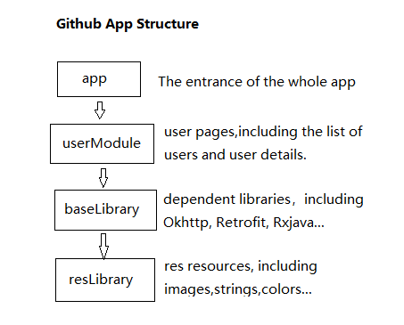

# Wiredcraft Mobile Developer Coding Test

A simple Github App, builed by Android SDK 29, Kotlin 1.3.50.

## 1.Initialize project structure on Mar 21, 2020

The project is based on the MVP framework, using libraries such as Okhttp, Retrofit, Rxjava, Glide...

Maybe this structure is not suitable for this small Github APP with only two pages, but it is very suitable for the general commercial APP. It is very extensible and easy to maintain, which is why I choose it.

In the "test-mobile/GithubApp/config.gradle", all dependent libraries versions are included and can be easily modified here.

"test-mobile/GithubApp/app/src/main/java/com/josie/githubapp/WelcomeActivity.kt" is the entrance of the whole APP. You can flexibly configure the modules and pages you want to enter after opening the APP. Of course, you can also delete some modules you don't need.

The following is a structure diagram of the project, detailing the relationships between the modules.

## 2.Delete redundant files on Mar 21, 2020

Delete some useless files.

## 3.Complete several functions on Mar 22, 2020

The requirements for the Github APP are completed, including the list of users and user details.

## 4.Add unit tests on Mar 23, 2020

Sorry, I tried to add unit tests, but I failed, leaving only two unfinished test files in the "test-mobile\GithubApp\userModule\src\test\java\com\josie\usermodule\presenter" directory, which is what I will learn next.

the "test-mobile/GithubApp/Github.apk" is a packaged apk that you can install on your Android phone.

## 5.Problems

Getting data from the github API is sometimes problematic, so sometimes the APP can't get data,just show "Server exception, please try again".

